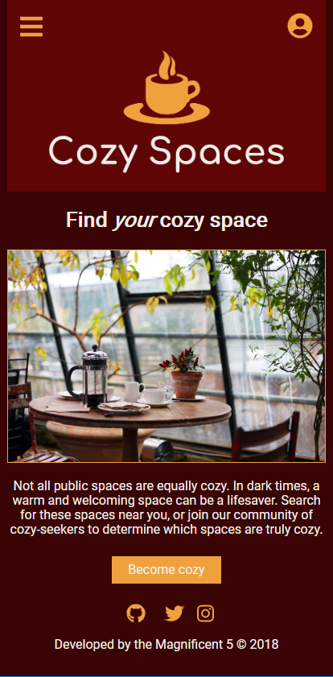
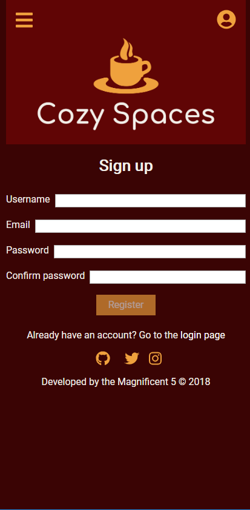
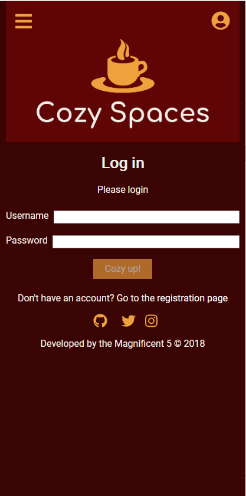
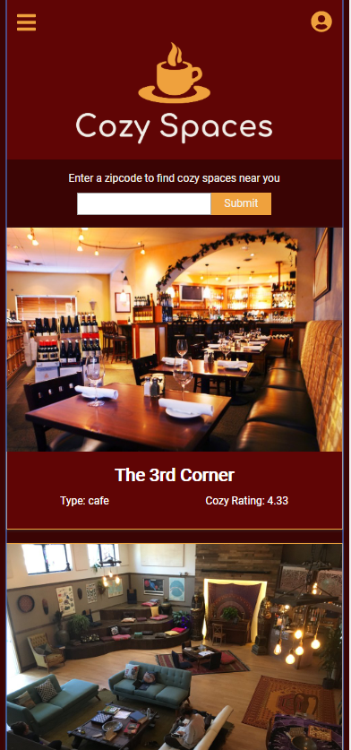
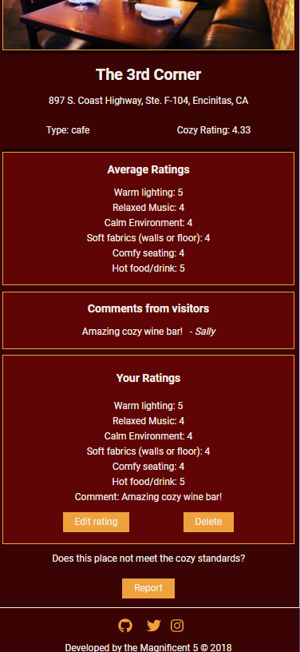
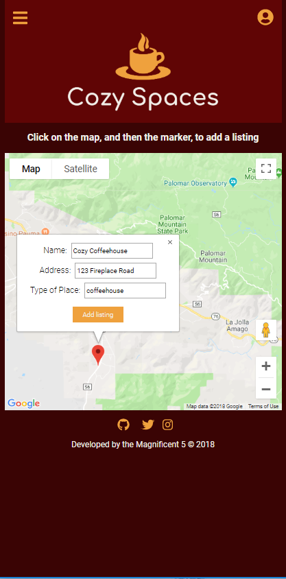

![Cozy Spaces Logo][logo]

[logo]: img/icon-left-logo-cropped-readme.png
[twitter]: img/Twitter_Logo_Blue42pxcropped.png
[instagram]: img/glyph-logo_May201629px.png
[producthunt]: img/product-hunt-logo-orange-28px.png
[github]: img/GitHub-Mark-32px.png
[1]: https://twitter.com/CozySpacesApp
[2]: https://www.instagram.com/cozyspacesapp/
[3]: https://github.com/thinkful-ei23/CozySpacesServer

Cozy Spaces is focused on bringing a warm glow to life through curating truly cozy spaces, especially for anyone experiencing cold climates, and/or nostalgia of a cozier time.  Need a cozy space to warm up your toes and light up your soul?  **_[Find one here](https://cozy-spaces-client.herokuapp.com/ "Cozy Spaces")_**&nbsp;

[![Twitter Icon][twitter]][1]&nbsp;&nbsp;
[![Instagram Icon][instagram]][2]&nbsp;&nbsp;&nbsp;&nbsp;
[![Product Hunt Icon][producthunt]][1]

## V1 Feature List
  * Users are taken to an introductory landing page the first time they visit the app.  If they have previously visited Cozy Spaces, they will be taken directly to listings of cozy spaces.
  * Users can access a learn more section to learn about categories of coziness.
  * Users can see cozy places based on their current location, or based on a zip code they enter.
  * Users can click on a cozy place to see details of that cozy place, including average ratings and comments from the Cozy Spaces community.
  * If users would like to rate a place, they can create an account/log in and then they will be able to rate a place, as well as edit or delete their rating.
  * Logged in users can add a cozy place by clicking a location on a map and adding information about that location.
  * Logged in users can access their username and email in their profile, where they can also delete their account.

## Screenshots
|  |  |  |
|:---:|:---:|:---:|
| Landing Page | Registration | Login |

|  |  |  |
|:---:|:---:|:---:|
| Listings | Specific Place Details | Add Listing |

## V2 Feature List
  * Logged in users can upload photos of cozy places.
  * Users can see all of the closest cozy places on a map, or on a list.  List view will include distance from their location.
  * Users can see all the cozy places they have rated in their profile, as well as save their favorite cozy spaces in their profile.  They can add a statement to their profile defining what coziness means to them.
  * Users can follow other users (let's call them cozy curators) to see/keep up with the cozy curator's favorite cozy spaces.
  * User profile includes a count of number of people following that user.
  * User can "like" the comment of any other user.
  * User can access a terms of service(TOS).
  * User can filter places based on tags.
  * User, if they choose to enter a zip code to interact with places, can interact with the app using that location as if it were their current location, even it is not.
  * Emails validated as existing emails.
  * Accounts archived instead of deleted.

## Developers
  * [Alexander Puhl](https://github.com/AlexanderPuhl)
  * [Burke Koontz](https://github.com/burkeKoontz)
  * [Jemadean Dobrosielski](https://github.com/JemDobro)
  * [Selvin Norman](https://github.com/selvinor)

## Tech Used

### Front End

  * HTML5
  * CSS3
  * JavaScript
  * React
  * Redux
  * GoogleMap API

<h3>Back End</h3> [![GitHub Icon][github]][3]

  * Node/Express
  * MongoDB/Mongoose
  * JWTs for authentication

### Testing and Deployment  

  * Mocha -testing framework
  * Chai - assertion library for Node
  * Heroku - deployment
  * mLab - cloud database service 

## API Documentation

[Click to view API Documentation](https://documenter.getpostman.com/view/4458639/RzZCEdYf)

